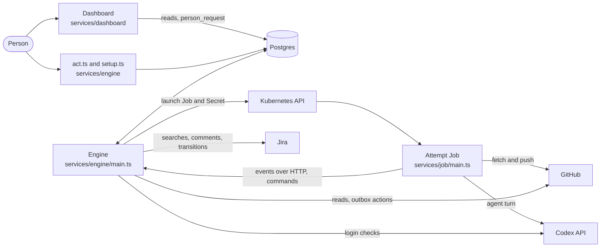

# How AutoWorker works

AutoWorker is three programs around one Postgres database. The engine runs every loop that moves work forward. The dashboard shows people what is happening and takes their requests. An attempt Job runs one agent on one step of one task, in its own Kubernetes Job. This page follows a ticket from Jira to a merged pull request through each part, then explains how failures, people, and crashes are handled. [foundation.md](foundation.md) explains why the parts are shaped this way. The reference pages hold the full tables.

## The pieces and how they connect

- **The engine** is one program, `services/engine/main.ts`. It runs nine loops on fixed intervals and serves the bridge endpoint that Jobs call. It holds the credential key, opens credentials, calls GitHub and Jira, and launches Jobs. [reference/engine.md](reference/engine.md) lists every loop and setting.
- **The dashboard** is a Next.js app in `services/dashboard/`. It connects to Postgres as a login role in the `dashboard` role, reads what its pages show, and writes only `person_request` rows, apart from replacing a login.
- **The attempt Job** runs from the attempt image built from `services/job/Dockerfile`. Its entry point, the bridge, runs Codex's app server for one turn, sends every event to the engine over HTTP, takes commands such as steers, and pushes the result. It has no database or Kubernetes credentials.

The engine and the dashboard share only Postgres. A Job never reaches Postgres. It reaches the engine only through the bridge endpoint, with a token the engine issued for that one attempt.

## Where the code lives

| Folder | Holds |
| --- | --- |
| `services/engine/`, `services/dashboard/`, `services/job/` | Entry points. They wire features together and hold no logic |
| `features/<name>/` | Everything for one feature: its code, pages, model, simulator, scenarios, and fixtures |
| `shared/` | Code that two or more features use |
| `tools/` | The verification tool and the checks. Services and shared code never import it, and features import only `tools/verify/` |
| `db/migrations/` | The schema, as plain SQL that dbmate runs |

Imports only point down. Services import features and shared code, features import shared code, and shared code imports neither. Features never import each other, and no service imports another. `npm run boundaries` enforces this with dependency-cruiser, so two features that need the same code move it to `shared/` instead of importing each other.

| Feature | What it does |
| --- | --- |
| `tasks` | Claims, attempts, the step machine, routes and caps, person actions, the reaper, the worker, setup, and the task model |
| `code-change` | The Code change workflow, its agent step plug and prompts, and Land |
| `jobs` | Building, launching, and sweeping attempt Jobs, and the Job's workspace, push, and reproduction |
| `bridge` | The engine endpoint for Jobs, the Job side of the bridge, and delivery of events and commands |
| `environments` | Verify providers and the loop that stops their environments |
| `outbox` | Enqueuing and performing actions on outside services |
| `requests` | Applying person requests |
| `routines` | The scheduler, routine runs, and sources |
| `routine-editor` | The routine pages and the `save_routine` request |
| `credentials` | The sealed credential store, credential checks, and the check loop |
| `github`, `jira` | Connectors: clients, performers, and reads |
| `task-page`, `overview`, `people`, `repository-settings` | Dashboard pages and their reads |
| `e2e` | The end-to-end test, its worlds and fakes, the Codex stand-in, the hold, and the local engine |

## The life of a ticket

### 1. A routine finds the ticket

A routine is a goal, a schedule, a source of work, and a workflow, stored in Postgres and versioned on every save. The `scheduler` loop in `features/routines/scheduler.ts` claims each routine's next due slot, or a waiting Run now press, as a `routine_run` row, so one slot runs once even with several engines. It runs the routine's source as the routine's run-as person, or else its creator. The core's Jira source searches with the routine's JQL.

Each work item has a key, such as the ticket key, that is unique across every routine. Recording the run inserts a `task` at the workflow's first step, or refreshes the assignee of a task that already exists, in one transaction with the run's end. A key another routine already owns is recorded in `routine_overlap` instead of creating a second task.

### 2. The worker claims the task

The `worker` loop in `features/tasks/worker.ts` takes each ready task that is at an agent step, owes no outside action, and has no live attempt.

1. **The run-as rule** names the person the attempt acts as: the routine's fixed identity, or else the ticket's current Jira assignee. With nobody to run as, the task parks and says so. The rule is `coreRunAs` in `features/tasks/run-as.ts`, a plug-in a fork can replace.
2. **`begin`** in `features/tasks/begin.ts` decides where the attempt starts and what it owes. The start is a lost attempt's last push, else the task branch's head, else the repository branch's head. If the task came back from a later step, `begin` finds the attempt that sent it back and builds a typed rework obligation from it, reading GitHub for a conflict's base head or a failed check's log. It also collects any person's note given since.
3. **`claim`** in `features/tasks/claim.ts` inserts the attempt in one statement, fenced on the task's epoch and newest attempt id that `begin` saw. Postgres refuses a second live attempt, a claim on a task that is not ready, and an attempt with no person. `claim` maps each refusal to an answer: `busy`, `not-ready`, `moved`, or a park. The attempt gets a lease, its own branch `autoworker/<key>-attempt-<n>`, its start commit, and its obligation.

### 3. The worker launches a Job

Still in the worker, under an advisory lock on the attempt, the engine checks the run-as person's logins. An attempt whose Codex login has never been checked waits to launch until the `checks` loop checks it. `loginForJob` in `features/credentials/check-loop.ts` checks a login again when its last check is more than 6 hours old. It refuses a login that is missing, cannot be opened, is not `valid`, or expires before the Job's time limit, which ends the attempt `not_launched`, and otherwise hands over an access-only copy with the refresh token blanked. For Verify, it asks the repository's Verify provider to start an environment. Then it builds the prompt, issues the attempt's bridge token, and stores the turn's start command once.

`launch` in `features/jobs/launch.ts` applies a Job and a Secret, both named `autoworker-attempt-<id>`, with the Job owning the Secret. The Job has no retries, a deadline, no service account token, no role binding, and dropped capabilities. The Secret carries the attempt's token and id, the engine's address, the repository, the start commit, the person's GitHub token and access-only Codex login, the git author, and the plan for after the turn. The plan says either push, with an optional setup command and an optional base to merge, or reproduce, with the base commit to test against.

### 4. The agent works inside the Job

The Job's entry point runs as the `bridge` user. It prepares the workspace, and then runs the turn.

1. **The workspace.** The bridge fetches the start commit, and any base to merge, into its own git directory, which only `bridge` can read. The `codex` user clones that into `/workspace`. When the plan names a base to merge that the start does not already hold, `codex` starts `git merge --no-commit`, so a conflict or check rework begins with the merge in progress.
2. **The setup command.** When the repository names one, such as `npm ci`, it runs as `codex` before Implement's and Verify's turns, and its log goes to `/tmp/autoworker-setup.log`.
3. **The turn.** The bridge starts `codex app-server` as `codex`, with approval policy `never` and full access inside the Job, on the model `gpt-6-luna`. It numbers every event, sends each to the engine until the engine acknowledges it, and reads commands, such as a steer or a stop, from a stream the engine serves.
4. **After the turn.** For Verify, the Job runs the reproduction, described below. For every other agent step, `pushStep` commits every change in the workspace except the setup's own, refuses a merge that still holds conflict markers or reverts a base change, and pushes the attempt's branch. A tree equal to the start is `unchanged`, and nothing is pushed.
5. **The end.** The bridge posts an end line and exits once the engine has stored it.

### 5. The engine judges the attempt

The engine's bridge endpoint in `features/bridge/engine.ts` checks each call's token hash, protocol version, and process, stores each numbered event once and in order, and records the branch head each push reports. When the end line arrives, `finishStep` in `features/tasks/step-runner.ts` runs in the same transaction:

1. It takes the agent's final message, the review, and parses it.
2. The workflow's plug settles it. The plug is `agentSteps` in `features/code-change/stage-output.ts`. It turns the reply, the push, and any reproduction into an output, evidence, and sometimes an observed verdict. A rework that owes a change and pushed nothing gets a failure that parks the task at once, with the agent's own words.
3. The step's `judge`, which `step()` in `shared/workflow.ts` derived from the step's declaration, turns the output into a verdict. An unreadable reply is `blocked`, never a pass.
4. `advance` and `decide` in `features/tasks/advance.ts` and `features/tasks/decide.ts` pick what happens next from the workflow's route for that verdict, and update the counters.
5. The attempt ends and the task moves, in one statement, and the actions the verdict owes are enqueued in the same transaction.

### 6. The steps of Code change

Code change is the one workflow the core ships, declared in `features/code-change/workflow.ts`. [reference/code-change.md](reference/code-change.md) lists every step's input, output, verdicts, and routes.

| Step | Run by | Produces | On pass it owes |
| --- | --- | --- | --- |
| Specify | an agent | A written plan, with no file changes | A plan comment on the ticket, and the ticket's move to its start status the first time |
| Implement | an agent | A pushed change | The task branch `autoworker/<key>` advanced to the push, a draft pull request if none exists, and a comment |
| Verify | an agent, then the Job | A reproduction script, run on the base commit and on the change | An evidence comment, and the evidence in the pull request |
| Land | the engine | A merged pull request | A merge comment, the ticket's move to its end status, and the task branch's deletion |

A routine can mark any step before its last as a gate, which waits for a person's approval, and can set which step the task ends at.

### 7. Land merges the pull request

Land has no agent. The `land` loop in `features/code-change/land-loop.ts` reads each task at Land, claims it like an attempt, reads the pull request's merge state from GitHub as the task's person, and walks a rules table in `features/code-change/land.ts`. The first rule that matches decides. These are the main rules, in the table's order, and [reference/code-change.md](reference/code-change.md#lands-rules) lists all of them:

- **Queued.** The pull request is in the merge queue, so Land waits.
- **Merged.** The task is done.
- **Conflicting.** The task goes back to Implement with verdict `conflict`.
- **A check failed.** The task goes back to Implement with verdict `red_check` and the failing checks.
- **A green draft.** Land owes `pr.mark-ready`.
- **Checks running.** Land waits.
- **Changes requested.** The first review that asks for changes sends the task back to Implement. A later one parks the task, unless the routine ignores later reviews.
- **Ready.** Land owes `pr.merge` at the head it read.

When Land owes an action, it ends its attempt `handed_off` in the same transaction that enqueues the action, and a later pass reads the result. Land never merges directly. Each repository's own checks and rulesets set the bar, and AutoWorker adds none. When a pull request needs a review, Land asks the review step plug-in what to owe and what the waiting task shows. The core's `coreReview` owes nothing.

### 8. Actions happen through the outbox

Every effect on GitHub or Jira is an `outbox` row committed with the state that owes it. The `outbox` loop in `features/outbox/perform.ts` claims the oldest owed row per task with a lease, runs the connector's performer within a deadline, and records `done`, `refused`, or a failure it retries up to `OUTBOX_MAX_TRIES`. A performer whose target cannot catch duplicates, such as a Jira comment, first looks for its marker. While a task owes a row, its generated `ready` column is null, so no step starts until the last step's effects have landed. A row that fails for good parks the task, but keeps a person's open review.

### 9. The task ends

When Land sees the pull request merged, the task is done. The merge comment, the ticket's move to its end status, and the task branch's deletion go through the outbox. The `sweep` loop deletes the Jobs and Secrets of finished attempts, and the `environments` loop stops every Verify environment whose attempt ended.

## When a step fails

Every failure verdict has a route declared in the workflow, and `decide` follows it. The routes are:

- **fail.** Retry the step, and park after the third failure in a row.
- **return.** Go back to an earlier step and count a round. For example, `behavior_fail` returns to Implement with counter `rounds`, cap 3.
- **rerun.** Run the same step again and count it. For example, `environment_fail` reruns Verify with counter `reruns`, cap 3.
- **review.** Go back to Implement for the first review that asks for changes. A later one parks the task, or, for a routine that ignores later reviews, waits for GitHub to report the pull request mergeable.
- **await.** Wait for a person outside AutoWorker, such as a reviewer on GitHub.

`needs_input` always asks a person. Separate global caps, in `features/tasks/claim.ts`, cover lost attempts, stage retries, and input waits.

When a counter reaches its cap, the task parks. It waits with `waiting_on` set to `retry`, and a short reason says exactly what to do. For example, "Retry starts again at Implement, because the pull request conflicted with its base branch ten times, as other merges kept changing the files it changes. Press Retry once those merges slow down, and Implement merges the base branch again." Retry after a return cap starts again at the step the route returns to.

A task that goes back owes a rework obligation, built fresh at the next claim. The obligation tells the agent what sent the task back. For a failed check it carries the check's log. For a conflict it carries the base to merge. For Verify's finding it carries the whole evidence. For a review it carries the review. A conflict or failed-check rework also starts with the current base merging, so it works on the tree CI tested. A rework that owes a change and pushes nothing ends at once, and the task waits for a person. [lessons.md](lessons.md) explains why each rule exists.

## When a person acts

A person acts from the dashboard or with `node services/engine/act.ts`. Both write one `person_request` row through `request` in `shared/requests.ts`. The `requests` loop in `features/requests/apply.ts` applies the oldest open request per target, one transaction each, with a statement timeout. It records a `human_action` with the request's id and writes an answer, `recorded` or `refused` with a sentence the person understands.

Stop, Retry, Approve, and Send back end any live attempt and raise the task's epoch, so a claim `begin` prepared before the action is refused as `moved`. Answer records an answer to a question and keeps the task waiting until Approve. Steer delivers a message into a running turn, and the task page shows its delivery state: sent, received, and acted on. [reference/engine.md](reference/engine.md#person-actions) says what each action does.

## When something dies

- **An attempt holds a lease.** The bridge renews it while the Job reports in. The `reaper` loop marks an attempt whose lease lapsed `lost`, within one interval, and neither a worker nor a bridge can renew a lapsed lease. Three lost attempts in a row park the task. When the engine starts, and after a failed reaper pass, the reaper's `resume` extends every live lease first, so downtime alone loses nothing.
- **A new attempt continues a lost one.** It starts from the lost attempt's last push, and its prompt summarizes what that attempt finished.
- **A late result changes nothing.** A lost Job's late push lands on its own attempt branch, never the task branch, and a finished attempt is final in Postgres.
- **A Job has a deadline**, 4 hours by default, and a start lease of 15 minutes covers its whole launch.
- **An outbox claim has a lease too.** A lapsed claim is retried. A performer whose target cannot catch a duplicate looks for its marker before it acts again, and the others count the duplicate the service refuses as their own success.
- **A routine run and a credential check** also hold leases, released the same way.

## How Verify proves a change

Verify's agent reads the ticket and the plan and writes a reproduction script at `/tmp/autoworker-reproduce.sh`. The script must fail while the ticket's bug or missing feature is present, and pass once it is fixed. The agent changes no file.

The Job then runs the script itself, in `features/jobs/reproduce.ts`:

1. Stop every process the agent left, and read the script into memory.
2. For each side, the base commit first and then the change:
   1. Clear every file the agent or the other side left in the shared temp directories.
   2. Check out that commit fresh into a new folder, as the `reproduce` user, with its own home and temp folder.
   3. Run the setup command, then the script.

`behaviorOf` in `shared/reproduction.ts` turns the two runs into a verdict:

| Base run | Change run | Behavior | Verdict |
| --- | --- | --- | --- |
| Fails | Passes | `fixed` | `pass` |
| Fails | Fails | `still_wrong` | `behavior_fail`, back to Implement with the evidence |
| Passes | anything | none, the script shows nothing | `environment_fail`, Verify reruns |
| Cannot run (exit 126 or 127, a missing command, a syntax error), or timed out | anything | none | `environment_fail`, Verify reruns |
| No script, or a failed checkout or setup | anything | none | `environment_fail`, Verify reruns |

The verdict comes from those runs, not from what the agent says. The evidence, meaning the script and both runs, is saved in `evidence` and posted to the ticket, and on a pass to the pull request as well.

A Verify provider in `features/environments/` makes the environment Verify checks behavior in, one per attempt. The core's `tests-only` provider starts nothing. It points Verify's agent at its own workspace and the repository's fast test command, or at the checks in the repository's CI config when there is no fast test command, and the prompt's environment section says which. A fork adds a provider that starts a faithful environment, such as a namespace with the service running. The `environments` loop stops every environment whose attempt ended.

## Who an attempt acts as

Every attempt runs as a person, and every outside call names that person.

- The run-as rule picks the person for each attempt: the routine's fixed identity, or else the ticket's current assignee, matched by Jira account id.
- The Job pushes with that person's GitHub token, and the agent works with that person's access-only Codex login.
- Outbox actions act as the person of the attempt that owed them.
- Land reads the pull request as the person of its newest attempt.

A person's credentials are sealed with AES-256-GCM, with the connector and owner as additional data, before they reach Postgres. The key comes from the environment of the engine, and of the dashboard when it may replace logins, and never reaches the database, a log, or an error. A person's credential reaches Postgres only through `replace` in `features/credentials/store.ts`, which calls the `security definer` function `replace_credential`, and that function records a `human_action` in the same statement. A Codex login the engine refreshed goes back through `writeBack` in the same file, which writes only over the login the check opened. The `checks` loop proves each stored login works, and refreshes a Codex login in its last five minutes. Only the engine ever refreshes, because a refresh token works once, and refreshing signs out every other copy of that login.

## What the dashboard shows

Each page is a server component in `services/dashboard/app/` that calls one read from its page feature and renders that feature's components.

| Page | Shows |
| --- | --- |
| `/` | Needs you: what waits on the acting person |
| `/tasks` | Every task, filtered |
| `/board` | One row per workflow, one column per step |
| `/tasks/<key>` | One task, with its status, steps, evidence, attempts, and the agent's live transcript |
| `/people` | People, and their logins by state |
| `/routines` | Routines, which people can edit, pause, and run now |
| `/repositories` | Each repository's settings |

The task page streams changes over server-sent events. Its `frames` in `features/task-page/stream.ts` polls Postgres every 250 ms and resumes from the last event id after a reconnect, so a browser never misses or repeats a line.

The dashboard never names a workflow or a step. It reads them from `published_workflow_step`, which the engine writes at start, so a fork's workflow appears on the board with no page change. A person picks who they are from the top bar, and that pick is trusted, because the dashboard has no sign-in yet.

## Where a fork plugs in

A fork changes behavior by passing its own value for one of these, and keeps taking upstream changes. Most are passed in `services/engine/main.ts`, workflows are listed in `services/engine/workflows.ts`, and Verify providers in `services/engine/providers.ts`. [extending.md](extending.md) has a recipe for each.

| Plug | What a fork changes with it |
| --- | --- |
| A workflow and its `AgentSteps` plug | New kinds of work, with their own steps, prompts, and routes |
| The run-as rule | Who an attempt acts as |
| The review step | What Land owes when a pull request needs a review |
| Verify providers | Where Verify checks behavior |
| Connectors and their performers | New outside services and actions |
| Sources | How routines find work |

Per-repository behavior, from the Job image to when a draft leaves draft, is not a plug. It is data in each `repository` row, which setup and the Repositories page write.

## Gaps in how it works today

These behaviors are known and not yet addressed. [foundation.md](foundation.md#where-the-design-is-thin-today) lists the gaps in the design as a whole.

- **Job status.** The engine never reads a Job's Kubernetes status. A Job that never starts, for example from an image that cannot be pulled, holds its attempt until the 15-minute start lease lapses.
- **Verify's base.** Verify always tests against the task's first start commit, even after a rework merged a newer base.
- **Red checks with `at-once` drafts.** For a repository whose drafts leave draft at once, a red check fails Land's own attempt instead of sending the task back. Land then retries twice and parks.
- **Undeclared actions.** Land's step declares only `pr.merge` in its `owes`, but Land also owes `pr.mark-ready` and `pr.update-branch`, and after a merge a `ticket.comment`, a `ticket.transition`, and a `branch.delete`. They work only because the connectors register performers for them.
- **The stand-in's reproduction.** The e2e test keeps its own copy of the reproduction in `features/e2e/stand-in-check.ts`, which does not clear temp or run as `reproduce`, so it can drift from the real one.
- **The local fakes.** The fake GitHub has no reviews and no merge queue, so no local lane runs Land's review or queue paths.
