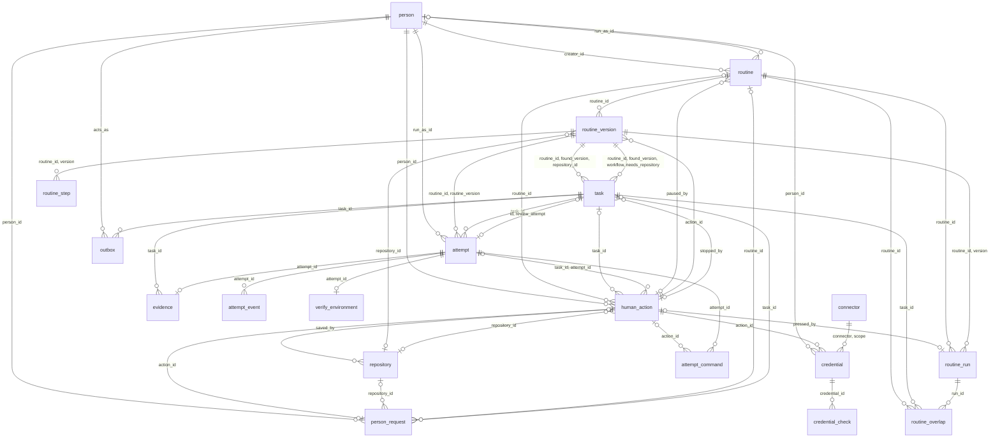

# Data model reference

Postgres is AutoWorker's one record. Tasks, attempts, verdicts, person actions, owed outside actions, and credentials are rows, and the rules they keep are constraints, indexes, and triggers that Postgres enforces. The schema is plain SQL in [db/migrations/](../../../db/migrations/), which dbmate applies in version order. AutoWorker requires Postgres 18, because the migrations name not-null constraints and rename default ones, and Postgres keeps a not-null as a named constraint only from version 18. [tools/verify/postgres.ts](../../../tools/verify/postgres.ts) pins `postgres:18-alpine` by digest. `npm run db:types` generates [shared/db/types.ts](../../../shared/db/types.ts) from the migrated schema, and nobody edits it by hand. This page describes the schema after all 46 migrations. [architecture.md](../architecture.md) shows how the engine and the dashboard use it.

## What refers to what

Each line is a foreign key, labeled with the columns that refer. `published_workflow_step` and `published_provider` have none and are left out.

`attempt` also refers to `task` through `live_attempt_matches_ready_task`. `human_action.connector` names a connector kind with no foreign key.

## Tables by owning feature

Each table sits under the feature whose catalog audits its guards. A catalog gives every guard a mutant, which a simulator run or a store probe proves, or a reason in `noMutantYet`. Four tables have no catalog and sit under the feature that writes them. The 21 tables are the keys of `DB` in `shared/db/types.ts`.

- `id` is `bigint generated always as identity primary key`. Kysely selects every `bigint` as a string. Callers make the `uuid` ids of `human_action` and `person_request`.
- `= x` is a default. A name in the Null column is a named not-null that a guard relies on. Other not-nulls, and every primary key not listed as a guard, keep default names, which the catalogs skip.
- A guard is a named constraint, index, or trigger. A kind such as "check (bridge)" marks a guard that the bridge feature added to another feature's table. Its name starts with `bridge_`, and the bridge catalog lists it.
- `repository_saved_by_action` and `steer_cites_its_action` are deferred to commit. A new repository and its `add_repository` action refer to each other, and `steerWithin` numbers a steer before it records the steer's action.

### Tasks

[features/tasks/catalog.ts](../../../features/tasks/catalog.ts) audits the four domains and every table below except `evidence` and `published_workflow_step`. `catalogCheck` in [features/github/catalog.ts](../../../features/github/catalog.ts) audits the two `github_` checks on `repository`.

#### `person`

People and team accounts that attempts run as.

| Column | Type | Null | Meaning |
|---|---|---|---|
| `id` | `bigint` | not null | |
| `email` | `text` | not null | Lowercase |
| `name` | `text` | not null | |
| `kind` | `person_kind` = `person` | not null | `shared` is a team account |
| `jira_account_id` | `text` | null | Matched to a ticket's assignee |

| Guard | Kind | Rule |
|---|---|---|
| `one_person_per_email` | unique | `email` |
| `email_is_lowercase` | check | `email = lower(email)` |
| `one_person_per_jira_account` | unique | `jira_account_id` |

#### `repository`

A GitHub repository and base branch, with its settings.

| Column | Type | Null | Meaning |
|---|---|---|---|
| `id` | `bigint` | not null | |
| `github` | `text` | not null | `owner/name` |
| `branch` | `text` | not null | Base branch |
| `saved_by` | `uuid` | `repository_names_its_saving_action` | Last action that saved it |
| `verify_provider` | `text` = `tests-only` | not null | No foreign key, checked at engine start |
| `fast_test_command` | `text` | null | Test command named in every agent step's prompt, which `tests-only` points Verify at, or the CI config's checks when null |
| `job_image` | `text` | null | Its own attempt image, by digest |
| `ignorable_checks` | `text[]` = `{}` | not null | Checks Land ignores |
| `draft_leaves` | `draft_leaves` = `when-green` | not null | When Land marks the draft ready |
| `ignored_reviewers` | `text[]` = `{}` | not null | Reviewers whose change requests Land ignores |
| `setup_command` | `text` | null | Runs in the Job before the turn |

| Guard | Kind | Rule |
|---|---|---|
| `names_owner_and_repository` | check | `github ~ '^[A-Za-z0-9_.-]+/[A-Za-z0-9_.-]+$'` |
| `branch_not_blank` | check | `btrim(branch) <> ''` |
| `one_row_per_branch` | unique | `(github, branch)` |
| `repository_saved_by_action` | foreign key, deferred | `saved_by` refers to `human_action` |
| `job_image_named_by_digest` | check | `job_image ~ '^[a-z0-9][a-z0-9._/:-]*@sha256:[0-9a-f]{64}$'` |
| `github_ignorable_checks_are_named` | check (github) | no `''` or null in `ignorable_checks` |
| `github_ignored_reviewers_are_named` | check (github) | no `''` or null in `ignored_reviewers` |

#### `routine`

A routine's identity, its creator, and who it runs as. A change of `run_as_id` updates this row in place, so versions do not record it. Everything else a person edits lives in `routine_version`.

| Column | Type | Null | Meaning |
|---|---|---|---|
| `id` | `bigint` | not null | |
| `paused_by` | `uuid` | null | The pause action, while paused |
| `creator_id` | `bigint` | `routine_has_a_creator` | |
| `run_as_id` | `bigint` | null | Fixed person to run as, else the ticket's assignee |

| Guard | Kind | Rule |
|---|---|---|
| `pause_names_its_action` | foreign key | `paused_by` refers to `human_action` |
| `creator_is_a_person` | foreign key | `creator_id` refers to `person` |
| `run_as_is_a_person` | foreign key | `run_as_id` refers to `person` |

#### `routine_version`

One saved version of a routine. Primary key `(routine_id, version)`.

| Column | Type | Null | Meaning |
|---|---|---|---|
| `routine_id` | `bigint` | not null | |
| `version` | `int` | not null | |
| `name` | `text` | not null | |
| `goal` | `text` | not null | In plain words |
| `every` | `interval` = `15 minutes` | not null | Schedule interval |
| `repository_id` | `bigint` | null | |
| `action_id` | `uuid` | not null | The `edit_routine` action that saved it |
| `workflow` | `workflow_name` | `version_names_its_workflow` | |
| `source` | `jsonb` | `version_names_its_source` | How it finds work, named by `kind` |
| `needs_repository` | `boolean` | `version_records_its_repository_need` | |
| `gates` | `step_name[]` = `{}` | `version_lists_its_gates` | Steps that wait for approval |
| `last_step` | `step_name` | null | Where tasks end, else the workflow's last step |
| `ignore_later_reviews` | `boolean` = `false` | `version_says_how_it_treats_later_reviews` | Past the review cap, wait on `outside_approval` instead of parking |
| `jira_start_status` | `text` | null | Ticket status once Specify first passes |
| `jira_end_status` | `text` | null | Ticket status when the task ends |

| Guard | Kind | Rule |
|---|---|---|
| `version_of_routine` | foreign key | `routine_id` refers to `routine` |
| `goal_not_blank` | check | `btrim(goal) <> ''` |
| `every_is_a_positive_span_without_months` | check | above zero, with no years or months |
| `version_works_in_a_repository` | foreign key | `repository_id` refers to `repository` |
| `version_saved_by_action` | foreign key | `action_id` refers to `human_action` |
| `version_names_one_repository` | unique | `(routine_id, version, repository_id)` |
| `source_names_its_kind` | check | `source -> 'kind'` is a JSON string |
| `version_repository_when_needed` | check | `repository_id` set exactly when `needs_repository` |
| `version_workflow_rule` | unique | `(routine_id, version, workflow, needs_repository)` |
| `jira_start_status_is_named` | check | `jira_start_status` not blank |
| `jira_end_status_is_named` | check | `jira_end_status` not blank |
| `routine_version_is_final` | trigger | no update |

#### `routine_step`

A version's settings for one step. Primary key `(routine_id, version, step)`.

| Column | Type | Null | Meaning |
|---|---|---|---|
| `routine_id` | `bigint` | not null | |
| `version` | `int` | not null | |
| `step` | `step_name` | not null | |
| `instructions` | `text` = `''` | not null | Added to the step's prompt |
| `skills` | `skill_name[]` = `{}` | not null | Named in the step's prompt |

| Guard | Kind | Rule |
|---|---|---|
| `setting_of_version` | foreign key | `(routine_id, version)` refers to `routine_version` |
| `routine_step_is_final` | trigger | no update or delete |

#### `task`

One piece of work a routine found.

| Column | Type | Null | Meaning |
|---|---|---|---|
| `id` | `bigint` | not null | |
| `routine_id` | `bigint` | not null | Owning routine |
| `found_version` | `int` | not null | Version that found it |
| `repository_id` | `bigint` | null | |
| `key` | `text` | not null | From the source, unique across routines |
| `title` | `text` | not null | From the source |
| `step` | `step_name` | not null | Current step |
| `state` | `task_state` = `ready` | not null | |
| `lost` | `int` = 0 | not null | Attempts lost in a row |
| `retries` | `int` = 0 | not null | Step failures in a row |
| `waiting_reason` | `instruction` | null | What a person must do |
| `stopped_by` | `uuid` | null | The stop action |
| `found_at` | `timestamptz` | `task_records_when_it_was_found` | |
| `ready` | `boolean` generated | null | True when `state` is `ready` and `owed_actions` is 0, else null |
| `assignee_account_id` | `text` | null | The ticket assignee's account |
| `workflow` | `workflow_name` | `task_names_its_workflow` | |
| `needs_repository` | `boolean` | `task_records_its_repository_need` | |
| `approved` | `step_name[]` = `{}` | `task_lists_its_approvals` | Approved gates |
| `input_waits` | `int` = 0 | not null | Questions in a row |
| `counts` | `jsonb` = `{}` | `task_keeps_its_counts` | Route counters, such as `rounds` |
| `waiting_on` | `waiting_on` | null | |
| `review_attempt` | `bigint` | null | Attempt whose review the wait decides |
| `epoch` | `int` = 0 | not null | Raised by each person action that moves the task |
| `owed_actions` | `int` = 0 | not null | `owed` and `failed` outbox rows, kept by a trigger |

`caps` in `features/tasks/claim.ts` caps `lost` at 3, `retries` at 2, and `input_waits` at 3.

| Guard | Kind | Rule |
|---|---|---|
| `one_task_per_key` | unique | `key` |
| `task_works_where_its_routine_said` | foreign key | `(routine_id, found_version, repository_id)` refers to `routine_version`, skipped when `repository_id` is null |
| `task_follows_its_version` | foreign key | `(routine_id, found_version, workflow, needs_repository)` refers to `routine_version` |
| `stop_names_its_action` | foreign key | `stopped_by` refers to `human_action` |
| `task_waits_on_its_own_review` | foreign key | `(id, review_attempt)` refers to `attempt (task_id, id)` |
| `waiting_has_reason` | check | `waiting_reason` set exactly when `waiting` |
| `stopped_has_stop_action` | check | `stopped_by` set exactly when `stopped` |
| `waiting_says_on_what` | check | `waiting` needs `waiting_on` |
| `only_a_gate_stop_keeps_its_wait` | check | `waiting_on` set only while `waiting`, or `stopped` on `approval` |
| `review_wait_names_its_review` | check | `review_attempt` set exactly when `waiting_on` is `approval` or `answer` |
| `counts_are_an_object` | check | `counts` is a JSON object |
| `task_repository_when_needed` | check | `repository_id` set exactly when `needs_repository` |
| `live_attempt_target` | unique | `(id, routine_id, step, epoch, ready)` |
| `done_task_is_final` | trigger | no change to a done task's `state`, `step`, `retries`, `lost`, `input_waits`, `counts`, or `approved` |
| `routines_task_keeps_its_routine` | trigger (routines) | skips any update that changes `routine_id`, with no error |

#### `human_action`

The audit record of what a person did.

| Column | Type | Null | Meaning |
|---|---|---|---|
| `id` | `uuid` | not null | A request's action takes the request's id |
| `at` | `timestamptz` | `action_records_when_it_happened` | |
| `person_id` | `bigint` | not null | Who acted |
| `kind` | `human_action_kind` | not null | |
| `routine_id` | `bigint` | null | Target |
| `task_id` | `bigint` | null | Target |
| `detail` | `jsonb` = `{}` | not null | A note, an answer, or a credential audit |
| `connector` | `connector_kind` | null | Target of `replace_credential` |
| `repository_id` | `bigint` | null | Target |
| `attempt_id` | `bigint` | null | The review an answer decides |

| Guard | Kind | Rule |
|---|---|---|
| `action_taken_by_person` | foreign key | `person_id` refers to `person` |
| `action_on_routine` | foreign key | `routine_id` refers to `routine` |
| `action_on_task` | foreign key | `task_id` refers to `task` |
| `action_on_repository` | foreign key | `repository_id` refers to `repository` |
| `one_target` | check | exactly one of `routine_id`, `task_id`, `repository_id`, `connector` |
| `answer_names_its_review` | check | `attempt_id` set exactly for the answer kinds `approve`, `send_back`, `pick_choice`, `untick_items`, `edit_draft` |
| `target_fits_kind` | check | the answer kinds, `stop_task`, `retry_task`, and `steer_task` set `task_id`, `add_repository` and `edit_repository` set `repository_id`, `replace_credential` sets `connector`, the rest set `routine_id` |
| `review_of_its_task` | foreign key | `(task_id, attempt_id)` refers to `attempt (task_id, id)` |
| `send_back_has_a_note` | check | a `send_back` has a non-blank `detail.note` |
| `note_is_text` | check | `detail.note` absent or a non-blank string |
| `one_decision_per_review` | unique index | `attempt_id` where `kind` is `approve` or `send_back` |
| `human_action_is_final` | trigger | no update |

The credentials catalog also lists `one_target` and `target_fits_kind`.

#### `attempt`

One try at one step of a task.

| Column | Type | Null | Meaning |
|---|---|---|---|
| `id` | `bigint` | not null | |
| `task_id` | `bigint` | `attempt_names_its_task` | |
| `routine_id` | `bigint` | `attempt_names_its_routine` | |
| `routine_version` | `int` | `attempt_follows_a_goal_version` | Newest with the task's workflow, at claim |
| `step` | `step_name` | `attempt_names_its_step` | |
| `started_at` | `timestamptz` | `attempt_records_when_it_started` | Claim time |
| `lease_until` | `timestamptz` | `attempt_holds_a_lease` | |
| `finished_at` | `timestamptz` | null | |
| `verdict` | `verdict` | null | |
| `output` | `jsonb` | null | The step's judged output |
| `live` | `boolean` generated | null | True while unfinished, else null |
| `run_as_id` | `bigint` | `attempt_runs_as_a_person` | Person it acts as |
| `epoch` | `int` | `attempt_names_its_epoch` | The task's epoch at claim |
| `bridge_token_hash` | `bytea` | null | SHA-256 of the bridge's token |
| `bridge_process` | `uuid` | null | Process the first call bound |
| `high_water` | `bigint` = 0 | not null | Highest event number stored |
| `commands_received` | `bigint` = 0 | not null | Highest command number acknowledged |
| `branch` | `text` | null | `autoworker/<key>-attempt-<n>` |
| `start_commit` | `text` | null | Commit it started from |
| `last_pushed` | `text` | null | Last commit pushed |
| `job_created_at` | `timestamptz` | null | |
| `obligation` | `jsonb` | null | A `ReworkObligation` from `shared/rework.ts` |

| Guard | Kind | Rule |
|---|---|---|
| `attempt_of_task` | foreign key | `task_id` refers to `task` |
| `attempt_cites_goal_version` | foreign key | `(routine_id, routine_version)` refers to `routine_version` |
| `attempt_run_as_is_a_person` | foreign key | `run_as_id` refers to `person` |
| `live_attempt_matches_ready_task` | foreign key | `(task_id, routine_id, step, epoch, live)` refers to `task (id, routine_id, step, epoch, ready)` |
| `attempt_key_within_task` | unique | `(task_id, id)` |
| `one_live_attempt_per_task` | unique index | `task_id` where unfinished |
| `attempts_by_task` | index | `task_id` |
| `attempt_verdict_when_finished` | check | `verdict` set exactly when `finished_at` is |
| `review_when_judged` | check | `output` null exactly when `verdict` is null, `lost`, `stopped`, or `not_launched` |
| `attempt_branch_is_its_own` | check | `branch ~ '^autoworker/[A-Za-z0-9._/-]+-attempt-[1-9][0-9]*$'` |
| `start_is_a_commit` | check | `start_commit` is 40 lowercase hex characters |
| `push_is_a_commit` | check | `last_pushed` is 40 lowercase hex characters |
| `branch_starts_somewhere` | check | `branch` and `start_commit` both set or both null |
| `push_needs_a_branch` | check | `last_pushed` needs `branch` |
| `one_attempt_per_branch` | unique index | `branch` |
| `job_created_after_its_token` | check | `job_created_at` needs `bridge_token_hash` |
| `not_launched_created_no_job` | check | `not_launched` has no `job_created_at` |
| `obligation_names_its_kind` | check | null, or an object of `kind` `conflict` with a hex `head`, `check` with hex `head` and `base` and a `branch`, or `behavior`, `review`, or `note` |
| `finished_attempt_is_final` | trigger | no update once finished |
| `bridge_token_is_a_hash` | check (bridge) | `bridge_token_hash` is 32 bytes |
| `bridge_process_follows_its_token` | check (bridge) | `bridge_process` needs `bridge_token_hash` |
| `bridge_high_water_counts_lines` | check (bridge) | `high_water >= 0` |
| `bridge_received_counts_commands` | check (bridge) | `commands_received >= 0` |

While an attempt lives, `live_attempt_matches_ready_task` holds its task ready at the same step and epoch, so the task cannot owe an outbox row. The key is MATCH SIMPLE, so a finished attempt's null `live` skips it, and the named not-nulls on its other four columns keep it checked.

#### `evidence`

The evidence one attempt's step settled. `finishStep` in `features/tasks/step-runner.ts` writes it.

| Column | Type | Null | Meaning |
|---|---|---|---|
| `attempt_id` | `bigint` | not null | Primary key |
| `task_id` | `bigint` | `evidence_names_its_task` | |
| `body` | `jsonb` | `evidence_holds_a_body` | |
| `recorded_at` | `timestamptz` | `evidence_records_when` | |

| Guard | Kind | Rule |
|---|---|---|
| `one_evidence_per_attempt` | primary key | `attempt_id` |
| `evidence_of_attempt` | foreign key | `attempt_id` refers to `attempt` |
| `evidence_of_task` | foreign key | `task_id` refers to `task`, not checked against the attempt's task |
| `evidence_is_an_object` | check | `body` is a JSON object |
| `evidence_by_task` | index | `task_id` |
| `evidence_is_final` | trigger | no update |

#### `published_workflow_step`

The steps of each workflow the engine runs, for the dashboard. `publishWorkflows` in `features/tasks/start.ts` rewrites it at engine start. Primary key `(workflow, position)`.

| Column | Type | Null | Meaning |
|---|---|---|---|
| `workflow` | `workflow_name` | not null | |
| `position` | `int` | not null | From 1 |
| `name` | `step_name` | not null | |
| `run_by` | `text` | not null | `agent` or `engine` |
| `requires` | `text[]` | not null | Blocks a done review requires |
| `failures` | `jsonb` | not null | Route kind and target per failure verdict |

| Guard | Kind | Rule |
|---|---|---|
| `published_step_counts_from_one` | check | `position >= 1` |
| `published_step_run_by_agent_or_engine` | check | `run_by` is `agent` or `engine` |
| `published_failures_are_an_object` | check | `failures` is a JSON object |
| `published_step_named_once` | unique | `(workflow, name)` |

### Bridge

`catalogCheck` in [features/bridge/sim-scenarios.ts](../../../features/bridge/sim-scenarios.ts) audits these tables and every `bridge_` guard.

#### `attempt_event`

Each line an attempt's bridge streamed. `storeLine` in `features/bridge/engine.ts` deletes an item's fragments when the item completes.

| Column | Type | Null | Meaning |
|---|---|---|---|
| `attempt_id` | `bigint` | not null | |
| `seq` | `bigint` | not null | Line number |
| `kind` | `attempt_event_kind` | not null | |
| `method` | `text` | null | The line's method, if any |
| `item_id` | `text` | null | Item the line belongs to |
| `fragment` | `boolean` | not null | A streamed piece of an item |
| `body` | `jsonb` | not null | The line, with NUL stored as U+FFFD |
| `stored_at` | `timestamptz` | not null | |

| Guard | Kind | Rule |
|---|---|---|
| `one_event_per_number` | primary key | `(attempt_id, seq)` |
| `event_of_attempt` | foreign key | `attempt_id` refers to `attempt` |
| `event_numbers_count_from_one` | check | `seq > 0` |
| `fragment_names_its_item` | check | a fragment is an `app` line with an `item_id` |
| `fragments_by_item` | index | `(attempt_id, item_id)` where `fragment` |
| `event_needs_live_attempt` | trigger | no insert for a finished attempt |

#### `attempt_command`

Each command the engine sent an attempt's bridge.

| Column | Type | Null | Meaning |
|---|---|---|---|
| `attempt_id` | `bigint` | not null | |
| `seq` | `bigint` | not null | Command number |
| `kind` | `attempt_command_kind` | not null | |
| `input` | `text` | null | Prompt or steer message |
| `output_schema` | `json` | null | A start's schema, `json` to keep key order |
| `client_message_id` | `uuid` | null | Id the agent's lines carry back |
| `sent_at` | `timestamptz` | not null | When numbered |
| `received_at` | `timestamptz` | null | When the bridge acknowledged it |
| `acted_at` | `timestamptz` | null | When the agent acted on it |
| `action_id` | `uuid` | null | A steer's `steer_task` action |

| Guard | Kind | Rule |
|---|---|---|
| `one_command_per_number` | primary key | `(attempt_id, seq)` |
| `command_of_attempt` | foreign key | `attempt_id` refers to `attempt` |
| `command_numbers_count_from_one` | check | `seq > 0` |
| `command_carries_its_message` | check | `input` and `client_message_id` both null exactly for `turn.stop` |
| `only_a_start_has_a_schema` | check | only `turn.start` has `output_schema` |
| `acted_on_after_received` | check | `acted_at` needs `received_at` |
| `one_command_per_message` | unique | `client_message_id` |
| `steer_cites_its_action` | foreign key, deferred | `action_id` refers to `human_action` |
| `steer_names_its_person` | check | `turn.steer` needs `action_id` |
| `command_needs_live_attempt` | trigger | no insert for a finished attempt |

### Outbox

`checkCatalog` in [features/outbox/simulate.ts](../../../features/outbox/simulate.ts) audits `outbox`.

#### `outbox`

Each outside effect a task owes, committed with the state that owes it.

| Column | Type | Null | Meaning |
|---|---|---|---|
| `id` | `bigint` | not null | |
| `task_id` | `bigint` | not null | |
| `position` | `int` | not null | Order in the task |
| `kind` | `text` | not null | A kind in `actionKinds` in `shared/actions.ts`, not checked |
| `payload` | `jsonb` | not null | |
| `acts_as` | `bigint` | not null | Person it runs as |
| `idempotency_key` | `text` | not null | Marker that finds a duplicate, 18 random bytes |
| `owed_at` | `timestamptz` | not null | |
| `state` | `outbox_state` = `owed` | not null | |
| `claim` | `uuid` | null | The performer's claim |
| `lease_until` | `timestamptz` | null | |
| `tries` | `int` = 0 | not null | |
| `last_error` | `text` | null | |
| `result` | `jsonb` | null | The performer's result |
| `settled_at` | `timestamptz` | null | When it left `owed` |

| Guard | Kind | Rule |
|---|---|---|
| `row_of_task` | foreign key | `task_id` refers to `task` |
| `row_acts_as_a_person` | foreign key | `acts_as` refers to `person` |
| `idempotency_key_is_unique` | unique | `idempotency_key` |
| `one_row_per_place_in_its_task` | unique | `(task_id, position)` |
| `marker_cannot_be_guessed` | check | `idempotency_key ~ '^[A-Za-z0-9_-]{22,}$'` |
| `claim_holds_a_lease` | check | `claim` and `lease_until` both set or both null |
| `only_owed_rows_are_claimed` | check | only an `owed` row has a `claim` |
| `settled_row_says_when` | check | `settled_at` null exactly while `owed` |
| `performed_row_keeps_its_result` | check | `result` set exactly when `done` or `refused` |
| `failed_row_keeps_its_error` | check | `failed` needs `last_error` |
| `unsettled_rows_by_task` | index | `(task_id, position)` where `owed` or `failed` |
| `task_counts_its_owed_actions` | trigger | keeps `task.owed_actions` |
| `failed_row_parks_its_task` | trigger | on `owed` to `failed`, parks a ready or waiting task on `retry`, but only adds the failure to the reason of an `approval` or `answer` wait |
| `done_task_drops_rows_behind_a_failure` | trigger | on `owed` to `failed` in a done task, marks its later unclaimed `owed` rows `dropped` |

### Credentials

The catalog in [features/credentials/mutants.ts](../../../features/credentials/mutants.ts) audits `connector`, `credential`, and the two target checks on `human_action`. `catalogCheck` in `features/credentials/verify.ts` audits `credential_check`.

#### `connector`

Each connector kind and its scope. Only migrations write it, and its rows are `codex`, `github`, and `jira`, all `personal`.

| Column | Type | Null | Meaning |
|---|---|---|---|
| `kind` | `connector_kind` | not null | Primary key |
| `scope` | `connector_scope` | not null | |

| Guard | Kind | Rule |
|---|---|---|
| `credential_scope_target` | unique | `(kind, scope)` |

#### `credential`

One sealed secret per connector and owner.

| Column | Type | Null | Meaning |
|---|---|---|---|
| `id` | `bigint` | not null | |
| `connector` | `connector_kind` | `credential_names_its_connector` | |
| `scope` | `connector_scope` | `credential_states_its_scope` | Copied from `connector` |
| `person_id` | `bigint` | null | Owner of a `personal` credential |
| `ciphertext` | `bytea` | `credential_holds_a_seal` | 12-byte nonce, AES-256-GCM ciphertext, 16-byte tag |
| `key_version` | `int` | not null | Version of the sealing key |
| `expires_at` | `timestamptz` | null | Login expiry, where known |
| `action_id` | `uuid` | `credential_cites_its_action` | The replacement that wrote it |
| `state` | `credential_state` | null | Last check's verdict |
| `checked_at` | `timestamptz` | null | |

| Guard | Kind | Rule |
|---|---|---|
| `credential_of_person` | foreign key | `person_id` refers to `person` |
| `ciphertext_holds_nonce_and_tag` | check | `octet_length(ciphertext) > 28` |
| `credential_written_by_action` | foreign key | `action_id` refers to `human_action` |
| `credential_scope_matches_connector` | foreign key | `(connector, scope)` refers to `connector (kind, scope)` |
| `one_credential_per_connector_and_person` | unique, nulls not distinct | `(connector, person_id)` |
| `personal_credential_has_person` | check | `person_id` set exactly when `scope` is `personal` |
| `checked_credential_has_time` | check | `state` and `checked_at` both set or both null |
| `stored_login_is_newest` | trigger | no update that keeps `action_id` and moves a set `expires_at` earlier or to null |

#### `credential_check`

One run of a credential's check, under a lease.

| Column | Type | Null | Meaning |
|---|---|---|---|
| `id` | `bigint` | not null | |
| `credential_id` | `bigint` | not null | |
| `replacement` | `uuid` | not null | The `action_id` it opened, with no foreign key |
| `opened_expires_at` | `timestamptz` | null | The expiry it opened |
| `refreshes` | `boolean` | not null | May use a refresh token |
| `checker` | `text` | not null | Who claimed it |
| `claimed_at` | `timestamptz` | not null | |
| `lease_until` | `timestamptz` | not null | |
| `finished_at` | `timestamptz` | null | |
| `outcome` | `check_outcome` | null | |
| `cause` | `text` | null | Why, in words |

| Guard | Kind | Rule |
|---|---|---|
| `check_of_credential` | foreign key, cascade | `credential_id` refers to `credential`, deleted with it |
| `finished_check_has_outcome` | check | `outcome` set exactly when `finished_at` is |
| `one_live_check_per_credential` | unique index | `credential_id` where unfinished |
| `one_refresh_per_login` | unique index, nulls not distinct | `(credential_id, replacement, opened_expires_at)` where `refreshes` |
| `finished_check_is_final` | trigger | no update once finished |

### Routines

[features/routines/catalog.ts](../../../features/routines/catalog.ts) audits these tables and every `routines_` guard.

#### `routine_run`

One run of a routine, from its schedule or a Run now press.

| Column | Type | Null | Meaning |
|---|---|---|---|
| `id` | `bigint` | not null | |
| `routine_id` | `bigint` | not null | |
| `version` | `int` | `run_follows_a_version` | |
| `reason` | `run_reason` | not null | |
| `slot` | `timestamptz` | null | `date_bin(every, now, slotOrigin)` |
| `pressed_by` | `uuid` | null | The `run_now` action |
| `claim` | `uuid` | null | The engine's claim |
| `claimed_at` | `timestamptz` | null | |
| `lease_until` | `timestamptz` | null | |
| `started_at` | `timestamptz` | null | |
| `finished_at` | `timestamptz` | null | |
| `finished_by` | `uuid` | null | Claim that finished it |
| `outcome` | `run_outcome` | null | |
| `covers` | `int` = 1 | not null | Slots it covers, missed ones included |
| `found` | `int` = 0 | not null | Work items found |
| `note` | `text` | null | Why it failed |

| Guard | Kind | Rule |
|---|---|---|
| `run_of_routine` | foreign key | `routine_id` refers to `routine` |
| `run_now_names_its_press` | foreign key | `pressed_by` refers to `human_action` |
| `run_cites_its_version` | foreign key | `(routine_id, version)` refers to `routine_version` |
| `run_is_keyed_by_its_reason` | check | `slot` set exactly for `schedule`, `pressed_by` exactly for `run_now` |
| `one_run_per_slot` | unique | `(routine_id, slot)` |
| `one_run_per_press` | unique | `pressed_by` |
| `claim_holds_a_lease` | check | `claim`, `claimed_at`, `lease_until`, `started_at` all set or all null |
| `outcome_when_finished` | check | `outcome` set exactly when `finished_at` is |
| `run_finishes_under_its_claim` | check | once finished, `finished_by` equals `claim` |
| `run_finishes_within_its_lease` | check | an outcome other than `lost` needs `finished_at <= lease_until` |
| `note_when_failed` | check | with an outcome, `note` set exactly when `failed` |
| `counts_are_whole` | check | `covers >= 1 and found >= 0` |
| `one_live_run_per_routine` | unique index | `routine_id` where claimed and unfinished |
| `one_waiting_press_per_routine` | unique index | `routine_id` where unclaimed and unfinished |
| `runs_by_routine` | index | `(routine_id, id)` |
| `run_claims_an_active_routine` | trigger | no claim of an unfinished run while its routine is paused |
| `finished_run_is_final` | trigger | no update once finished |

#### `routine_overlap`

A key one routine found while another routine owns its task. Primary key `(task_id, routine_id)`.

| Column | Type | Null | Meaning |
|---|---|---|---|
| `task_id` | `bigint` | not null | |
| `routine_id` | `bigint` | not null | Routine that also found it |
| `run_id` | `bigint` | not null | First run that found it |

| Guard | Kind | Rule |
|---|---|---|
| `overlap_of_task` | foreign key | `task_id` refers to `task` |
| `overlap_found_by_routine` | foreign key | `routine_id` refers to `routine` |
| `overlap_seen_in_run` | foreign key | `run_id` refers to `routine_run` |

### Environments

No catalog audits these tables.

#### `verify_environment`

One attempt's Verify environment, recorded before the provider's `start` is called. `features/environments/lifecycle.ts` writes it.

| Column | Type | Null | Meaning |
|---|---|---|---|
| `id` | `bigint` | not null | |
| `attempt_id` | `bigint` | not null | |
| `provider` | `text` | not null | No foreign key |
| `recorded_at` | `timestamptz` | not null | |
| `called_at` | `timestamptz` | not null | Last `start` call |
| `starting` | `int` = 0 | not null | `start` calls in flight |
| `result` | `jsonb` | null | What `start` returned |
| `returned_at` | `timestamptz` | null | |
| `stopped_at` | `timestamptz` | null | |

| Guard | Kind | Rule |
|---|---|---|
| `environment_of_attempt` | foreign key | `attempt_id` refers to `attempt` |
| `one_environment_per_attempt` | unique | `attempt_id` |
| `starting_is_not_negative` | check | `starting >= 0` |
| `result_has_its_time` | check | `result` and `returned_at` both set or both null |

#### `published_provider`

The Verify providers the engine was given. `publishProviders` in `features/environments/provider.ts` rewrites it at engine start.

| Column | Type | Null | Meaning |
|---|---|---|---|
| `name` | `text` | not null | Primary key |

| Guard | Kind | Rule |
|---|---|---|
| `published_provider_name_is_a_slug` | check | `name ~ '^[a-z][a-z0-9-]{0,63}$'` |

### Requests

[features/requests/catalog.ts](../../../features/requests/catalog.ts) audits `person_request`.

#### `person_request`

A person's request to the engine, answered once, in order per target.

| Column | Type | Null | Meaning |
|---|---|---|---|
| `id` | `uuid` | not null | The recorded action takes this id |
| `person_id` | `bigint` | not null | |
| `at` | `timestamptz` | not null | |
| `kind` | `text` | not null | A key of `requestKinds` in `shared/requests.ts` |
| `payload` | `jsonb` | not null | |
| `task_id` | `bigint` | null | Target |
| `routine_id` | `bigint` | null | Target |
| `target` | `text` generated | null | `task <id>`, `routine <id>`, `repository <id>`, or `new <id>` |
| `position` | `int` = 0 | not null | Place in the target's line |
| `answer` | `request_answer` | null | |
| `answered_at` | `timestamptz` | null | |
| `reason` | `text` | null | The refusal's sentence |
| `action_id` | `uuid` generated | null | `id` once `recorded` |
| `repository_id` | `bigint` | null | Target |

| Guard | Kind | Rule |
|---|---|---|
| `request_asked_by_person` | foreign key | `person_id` refers to `person` |
| `request_on_task` | foreign key | `task_id` refers to `task` |
| `request_on_routine` | foreign key | `routine_id` refers to `routine` |
| `request_on_repository` | foreign key | `repository_id` refers to `repository` |
| `answer_names_its_action` | foreign key | `action_id` refers to `human_action` |
| `request_names_one_target` | check | one target, or none for `save_routine` and `save_repository` |
| `request_kind_fits_target` | check | `stop`, `retry`, `approve`, `send_back`, `answer`, `steer` name a task, `pause`, `resume`, `run_now` a routine, `save_routine` no task or repository, `save_repository` no task or routine, and any other kind fails |
| `payload_is_an_object` | check | `payload` is a JSON object |
| `position_counts_from_one` | check | `position >= 1` |
| `one_request_per_position` | unique | `(target, position)` |
| `answer_says_when` | check | `answer` and `answered_at` both set or both null |
| `refusal_says_why` | check | `reason` set exactly when `refused`, never blank |
| `open_requests` | index | `(target, position)` where unanswered |
| `request_takes_next_place` | trigger | sets `position` on insert |
| `answer_is_final` | trigger | no update or delete once answered |

## Enums and domains

Values are in the order Postgres keeps, which `npm run verify -- migrations` compares. `shared/db/types.ts` sorts them alphabetically.

| Enum | Values |
|---|---|
| `task_state` | `ready`, `waiting`, `stopped`, `done` |
| `waiting_on` | `retry`, `approval`, `answer`, `outside_approval` |
| `verdict` | `pass`, `fail`, `behavior_fail`, `environment_fail`, `lost`, `stopped`, `needs_input`, `red_check`, `changes_requested`, `review_required`, `handed_off`, `not_launched`, `conflict` |
| `human_action_kind` | `edit_routine`, `pause_routine`, `resume_routine`, `stop_task`, `retry_task`, `replace_credential`, `approve`, `send_back`, `pick_choice`, `untick_items`, `edit_draft`, `add_repository`, `edit_repository`, `run_now`, `steer_task` |
| `person_kind` | `person`, `shared` |
| `connector_kind` | `codex`, `github`, `jira` |
| `connector_scope` | `team`, `personal` |
| `credential_state` | `valid`, `invalid`, `unknown` |
| `check_outcome` | `valid`, `invalid`, `unknown`, `lost` |
| `outbox_state` | `owed`, `done`, `refused`, `failed`, `dropped` |
| `run_reason` | `schedule`, `run_now` |
| `run_outcome` | `done`, `failed`, `paused`, `lost` |
| `attempt_event_kind` | `app`, `pushed`, `reproduced`, `end` |
| `attempt_command_kind` | `turn.start`, `turn.steer`, `turn.stop` |
| `draft_leaves` | `when-green`, `at-once` |
| `request_answer` | `recorded`, `refused` |

Each domain is `text` with one named check.

| Domain | Check | Rule | Used by |
|---|---|---|---|
| `workflow_name` | `workflow_name_is_a_slug` | `^[a-z][a-z0-9-]{0,63}$` | each `workflow` column |
| `step_name` | `step_name_is_a_slug` | `^[a-z][a-z0-9-]{0,63}$` | `step`, `gates`, `last_step`, `approved`, `published_workflow_step.name` |
| `skill_name` | `skill_name_is_a_slug` | `^[a-z0-9][a-z0-9-]{0,63}$` | `routine_step.skills` |
| `instruction` | `instruction_is_a_sentence` | `^[A-Z].*[.]$` | `task.waiting_reason` |

`outbox.kind`, `repository.verify_provider`, and `verify_environment.provider` name kinds with no check on the value.

## Functions and triggers

Ten functions back the triggers and every credential replacement. The check loop and `writeBack` in `features/credentials/store.ts` update `credential` directly. Each trigger also appears in its table's guards.

| Function | Does | Run by |
|---|---|---|
| `refuse_change()` | raises `restrict_violation` named for the trigger | the nine triggers named `*_is_final` |
| `refuse_after_end()` | the same, when the row's attempt has finished | `event_needs_live_attempt`, `command_needs_live_attempt` |
| `refuse_claim_on_paused_routine()` | the same, when the routine, read `for share`, is paused | `run_claims_an_active_routine` |
| `refuse_older_login()` | raises `check_violation` named for the trigger | `stored_login_is_newest` |
| `keep_routine()` | returns null, so Postgres skips the update | `routines_task_keeps_its_routine` |
| `take_next_place()` | sets `position` to the target's highest plus one | `request_takes_next_place` |
| `count_owed_actions()` | adds the change in `owed` and `failed` rows to `task.owed_actions` | `task_counts_its_owed_actions` |
| `park_for_failed_row()` | parks the task, or extends a review wait's reason | `failed_row_parks_its_task` |
| `drop_rows_behind_failure()` | in a done task, marks the later unclaimed `owed` rows `dropped` | `done_task_drops_rows_behind_a_failure` |
| `replace_credential(...)` | writes a credential and its action | `replace` in `features/credentials/store.ts` |

**`replace_credential` is the only `security definer` function.** It takes `(replacement uuid, replaced_at timestamptz, replaced_by bigint, of_connector connector_kind, of_person bigint, sealed bytea, sealed_with int, expires timestamptz, audit jsonb)`, returns `bigint`, and sets `search_path = public, pg_temp`. One statement inserts the action `on conflict (id) do nothing` and, only if that insert happened, upserts the credential on `(connector, person_id)`, clearing `state` and `checked_at`. A reused action id returns null. `EXECUTE` is revoked from `PUBLIC` and granted to `dashboard`. `refuse_older_login()` is the only other function with `EXECUTE` revoked.

**Requests take places in commit order.** When two inserts race for one place, `one_request_per_position` refuses the second, and `request` in `shared/requests.ts` tries the insert up to 20 times. `request` refuses to run inside a transaction, which the failed insert would end.

**Refusals reach code by name.** `refusal()` in [shared/db/client.ts](../../../shared/db/client.ts) maps SQLSTATE `23505`, `23503`, `23514`, and `23001` to `unique`, `foreign_key`, `check`, and `final`, with the constraint's name, which the trigger functions set to the trigger's name. It maps `23502` to `not_null` with the table and column but no name. `claimRefusals` in `features/tasks/claim.ts` is the example.

**`check_step` is not in the schema.** The tasks simulator creates it, with a `lost_approval` table, in its scratch databases (`features/tasks/invariants.ts`). It finds a step's rows by `xmin`, so it waits up to a second for older client transactions to end.

## Roles and privileges

Migrations create one role, `dashboard`, as `nologin`. The dashboard service connects as a login role in `dashboard` that no migration creates, and `tools/verify/dashboard.ts` makes one for the verify tooling. Roles are cluster-wide, so one cluster holds one AutoWorker database, and the migrating user needs `CREATEROLE`.

[tools/verify/dashboard-grants.json](../../../tools/verify/dashboard-grants.json) is the list of record. `dashboard` selects only the listed columns, inserts only the question columns of `person_request`, and writes credentials and actions only by executing `replace_credential`. It never reads `credential.ciphertext` or `attempt.bridge_token_hash`. `npm run verify -- dashboard-grants` fails on any difference from the list or a readable `never` column, but no CI step runs it. `npm test` runs `credentials --mutant all`, which proves that a grant of select or update on the ciphertext, of select on all of `credential`, or of insert on `credential` or `human_action`, and a view or a second function that exposes the ciphertext, each gets caught. A page that needs a new read adds a grants migration and its line in the list, in one commit.

## Rules every migration follows

`AGENTS.md` states these rules, most of them in its [Migrations paved path](../../../AGENTS.md#paved-paths). That path also allows dbmate's `transaction:false` option after a marker line, which no file uses yet.

- **File name.** A migration is `db/migrations/<YYYYMMDDHHMMSS>_<name>.sql`. `npm run migration-versions` requires a digit prefix that no other file uses, because dbmate keys migrations by version.
- **One transaction.** dbmate runs each file in one transaction, and no file uses `transaction:false`.
- **Exact down.** `-- migrate:down` undoes exactly what `-- migrate:up` does. `npm run verify -- migrations`, in CI, applies the files one at a time, rolls each back to the schema before it, and applies all again. It compares relations, columns, constraints, indexes, trigger definitions, types and enum order, views, and functions.
- **No comments.** The two marker lines are the only comments, and no file holds `COMMENT ON`, which kysely-codegen would copy into `shared/db/types.ts`. `npm run sql-comments` checks both, in dollar-quoted bodies too.
- **No clock.** No column defaults to `now()`, and statements take times as `Date` parameters, so simulators run on a virtual clock. No tool checks this rule.
- **Names state the rule.** Name every check, unique constraint, foreign key, index, and trigger, and each not-null a guard relies on. A migration that renames a column also renames its default-named not-null by hand, as `20260924000100_workflows.sql` does for `task_step_not_null`, because Postgres keeps the old name and the catalogs skip only names that match their table and column.
- **Prefixes.** A guard on another feature's table starts with the adding feature's folder name. `catalogOwners` in `tools/verify/catalog.ts` hands `bridge_`, `github_`, and `routines_` names to those features. `jira_` is not listed, so the tasks catalog owns the two `jira_` checks.
- **Enum values before their use.** Postgres cannot use an enum value in the transaction that adds it, so the migration that adds a value never uses it, and the statements that use it go in a later migration. `20260924000000_workflow_kinds.sql` adds eleven values at once, and `20260924120200_routine_runs.sql` adds `run_now` beside statements that do not use it. A down rebuilds the type without the value, as `20260927100000_conflict_verdict.sql` does.
- **Generated types.** Run `npm run db:types` in the same change. `npm run db-types`, last in `npm run check`, fails when `shared/db/types.ts` differs from a fresh generation. Resolve a conflict in it by regenerating.

## Known sharp edges

**The budget is full.** [budget/budget.json](../../../budget/budget.json) caps migrations at 46, tables at 21, and named constraints, indexes, and triggers at 210. `npm run budget` counts exactly those numbers today, and no raise file exists. A new migration, table, or guard first needs `npm run budget -- --raise <unit> --why "<why>"` in its own commit. `node tools/budget/main.ts --report` recounts. It counts, per file, every name that follows `constraint`, `create index`, or `create trigger` in the up part, less the names the same file drops. So a `rename constraint` costs one, and dropping an older guard frees nothing.

**`claim_holds_a_lease` is on two tables.** `outbox` and `routine_run` each have a check by that name, with different rules. `refusal()` returns the name without the table, so the caller must know which table it wrote.

**A check that is null passes.** `obligation_names_its_kind` accepts an object with no `kind`, because `null in (...)` is null, and `source_names_its_kind` accepts a `source` with no `kind`, because `jsonb_typeof` of a missing key is null. Code refuses them instead. `claim` stores only the typed `ReworkObligation` that `begin` builds, and `reworkObligation` in `shared/rework.ts` refuses a kindless obligation when the step runner reads it. `source` in `shared/routine-draft.ts` refuses a kindless source before `features/tasks/setup.ts` writes it.

**Four tables have no catalog.** No audit covers `evidence`, `verify_environment`, `published_workflow_step`, or `published_provider`. Of their 18 guards, only `one_environment_per_attempt` has a mutant, in `environments-sim`, and a new guard there escapes every audit.

**`routines_task_keeps_its_routine` skips silently.** An update that changes `task.routine_id` changes nothing in that row, raises no error, and returns no row. `recordTasks` in `features/routines/record.ts` relies on this to spot keys another routine owns.

**The migrations check ignores privileges.** Its fingerprint leaves out grants, roles, rows, and whether a trigger is enabled. So the down of `20260926010000_dashboard_reads_people.sql` passes, although it revokes `person.jira_account_id`, which `20260925160000_dashboard_reads_overview.sql` granted first.

**Backfills disable `finished_attempt_is_final`.** `20260927090000_rework_obligation.sql` and `20260927110000_check_obligation_base.sql` update finished attempts between `disable trigger` and `enable trigger`, in both parts. A file that never enabled it again would still pass the migrations check.

**Retention has no code.** [docs/decisions.md](../../decisions.md#history-is-kept-for-180-days-and-transcripts-for-30) keeps attempts and evidence for 180 days and transcripts for 30, but no loop deletes rows by age. Product code deletes only fragments and stale published rows, so every other table only grows.
